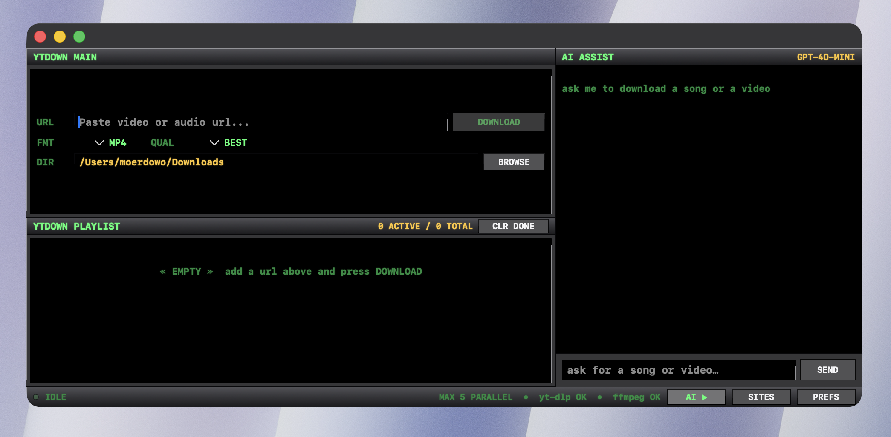

# Mindown

A native macOS video and audio downloader with a deliberately gaudy,
classic-Winamp UI and a built-in AI assistant.

Powered by [`yt-dlp`](https://github.com/yt-dlp/yt-dlp), a static `ffmpeg`,
and any OpenAI-compatible chat model you point it at.




## Highlights

- Paste a video or audio URL → pick format & quality → hit **DOWNLOAD**.
- Single-line **playlist** queue with an inline progress fill, up to **5
  parallel downloads**.
- **AI ASSIST** sidebar — chat-driven downloads. Ask "anti-hero by taylor
  swift as mp3" or "top 5 radiohead songs" and the model finds the right
  URL, format, and quality, then asks you to approve before queuing.
- **SITES** window — searchable list of every site `yt-dlp` supports
  (1900+), bundled offline so it works without a network round trip.
- Bundle ships with **yt-dlp** and a static **ffmpeg** matching your Mac's
  architecture, so end users do not need to install anything from the
  terminal.
- Custom Winamp-style chrome: beveled panels, green LCD readouts, dark
  grey gradients, classic monospaced bitmap-feel typography.

## Supported formats and qualities

- **Video** — MP4 / WEBM / MKV at BEST / 2160p / 1440p / 1080p / 720p /
  480p / 360p.
- **Audio** — MP3 / M4A / OPUS / WAV at BEST / 320 / 256 / 192 / 128 kbps.

## AI assistant

The right sidebar runs an OpenAI-compatible chat completions session.
Configure once with your **API key**, **base URL**, and **model**, and it
becomes a music-download front-end for the rest of the app:

- The model is allowed to call two tools — `search_youtube(query, limit)`
  and `propose_downloads(items[])`.
- `search_youtube` runs the bundled `yt-dlp ytsearch:` and returns up to
  10 candidates. The model picks the official version (skipping covers
  and reactions).
- `propose_downloads` surfaces an inline approval card. You tick or
  un-tick individual items and click **APPROVE** before anything is
  queued — nothing downloads automatically.

Works with anything that exposes `/chat/completions` — OpenAI, OpenRouter,
Groq, Together, Anthropic via gateway, local Ollama in OpenAI mode, etc.

## Build & run

```bash
./build.sh
open Mindown.app
```

The build script:

1. Downloads `yt-dlp_macos` from the official yt-dlp release.
2. Downloads a static `ffmpeg` matching your Mac's architecture
   (`darwin-arm64` on Apple Silicon, `darwin-x64` on Intel).
3. Downloads the latest `supportedsites.md` so the SITES window works
   offline.
4. Caches all three under `.bin-cache/` so subsequent builds skip the
   downloads.
5. Compiles the Swift app, assembles `Mindown.app`, copies the binaries
   into `Contents/Resources/bin/`, and ad-hoc-signs everything.

The resulting `.app` is fully self-contained — drop it anywhere, no
terminal install needed for end users.

## Develop

```bash
swift build           # debug
swift run Mindown     # run from the terminal (no .app bundle)
swift build -c release
```

Standard SwiftUI macOS app, single executable target, no third-party
Swift dependencies.

## Project layout

```
Sources/Mindown/
├── App.swift                 // @main entry, window styling
├── ContentView.swift         // Main UI — input row, queue, footer, sidebar
├── SettingsView.swift        // PREFS sheet (download dir, binary paths)
├── SupportedSitesView.swift  // SITES window (offline list + filter)
├── WinampStyle.swift         // Palette, beveled panels, LCD text, etc.
├── DownloadModels.swift      // MediaFormat / Quality / DownloadItem
├── DownloadManager.swift     // yt-dlp Process orchestration + progress
├── AppSettings.swift         // UserDefaults-backed preferences
├── AISettings.swift          // API key / base URL / model / sidebar
├── ChatModels.swift          // ChatMessage / Proposal / ProposedDownload
├── AIClient.swift            // OpenAI-compatible chat completions client
├── AITools.swift             // Tool definitions + host-side runners
├── AIChatView.swift          // Sidebar UI (form + chat + approval cards)
└── ChatViewModel.swift       // @MainActor orchestrator + tool-call loop
```

## Configuration

- **PREFS** sheet (footer button): override download directory, yt-dlp
  path, and ffmpeg path. Bundled binaries are picked up automatically on
  fresh installs.
- **AI ASSIST** sidebar: API key, base URL, model. Defaults to OpenAI's
  `gpt-4o-mini` against `https://api.openai.com/v1`.
- All values persist via `UserDefaults`.

## Notes

- This is not sandboxed or notarised — it is a personal-use tool. On
  first launch on another Mac, right-click → **Open** if Gatekeeper
  grumbles.
- The app uses `yt-dlp --progress-template` to parse percent / speed /
  ETA / total size from a structured pipe-delimited line, which is more
  reliable than scraping `[download]` console output.
- Output files are named `%(title).200B [%(id)s].%(ext)s` so duplicate
  titles do not clobber each other.

## License

Personal-use utility, no warranty. yt-dlp and ffmpeg are redistributed
under their respective licenses (Unlicense and LGPL/GPL respectively).
